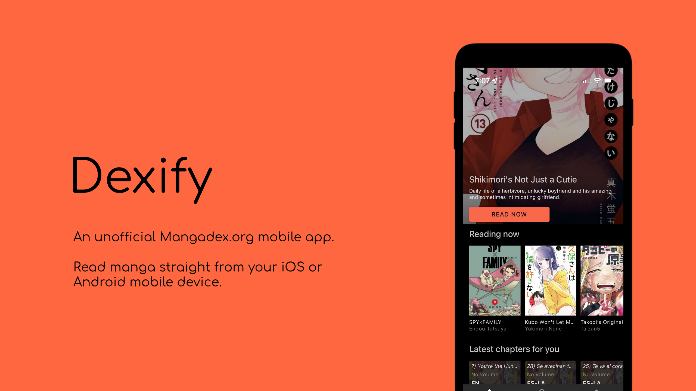

# Dexify

Welcome to [Dexify](https://www.akinyele.ca/projects/dexify-mobile). Discover and Read Manga from the comfort of your Android smartphone. <i>iOS version coming soon.</i>

## About

The app is available in the following countries:

- United States of America
- Canada
- United Kingdom
- Australia

You must be running Android 11 (API 31) or later in order to run the app.

The app use [Mangadex](https://mangadex.org)'s services ([ref](https://api.mangadex.org)) to display information. Anime information is taken from [youranime.moe](https://youranime.moe) which itself comes from [Kitsu](https://kitsu.io) and [Anilist](https://anilist.co).

The ability to read manga on this app is provided by Mangadex where the ability to read from official is provided whenever possible. See [Mangadex](https://mangadex.org) to learn more how they manage their data.
